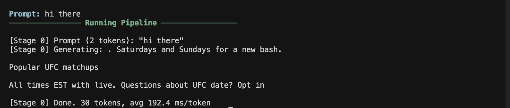
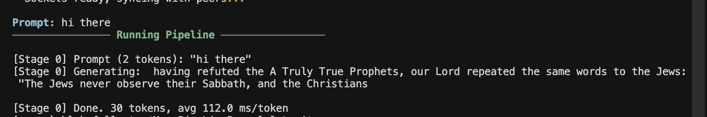

# Distributed Inference — Latency Mitigation Plan

Goal: make pipeline parallelism across WAN-connected CPU machines (WireGuard, different ISPs) actually usable. Starting point is the current GPT-2 pipeline in this repo — dense model, no KV cache, raw-bytes ZMQ, fully sequential Stage0→StageN→Stage0 round-trip per token.

Realistic target after the full stack: **3–8 TPS for a 70B-equivalent MoE model on 2–3 CPU machines across different internets.** Interactive-ish, not snappy. Good enough for agent workflows.

---

## Bottleneck analysis for current code

With 2 machines across WireGuard at ~40ms RTT, current `worker.py`:

1. Stage 0 runs embedding + blocks 0–5, sends hidden state (~500ms on CPU for GPT-2 medium).
2. Stage 1 receives, runs blocks 6–11 + LM head, samples, sends token back (~500ms).
3. Stage 0 waits on `token_pull` (blocks at `worker.py:121-122`), recomputes entire sequence next step (no KV cache — `worker.py:113` runs `stage_model(generated)` on the full growing sequence).

Per-token latency = 2 × compute + 2 × (network RTT + serialization). Every hop is fully sequential. Nothing is overlapped, nothing is compressed, nothing is cached. That's the enemy list.

---

## Phase 1 — Free wins (do these first, days of work, 5–10x speedup)

### ~~1.1 KV cache~~ ✅ DONE

~~**Biggest single win.** Currently `worker.py:113` and `worker.py:161` re-run the full sequence every step, so step N costs O(N²) compute and the hidden state you send grows every step (serialization cost grows too).~~

~~- Switch `model.py` stage modules to use HuggingFace `past_key_values` or roll your own cache per layer.~~
~~- After step 0, only send the hidden state for the **last token** across the wire — shape drops from `(1, N, 768)` to `(1, 1, 768)`. Network payload shrinks ~30x over a 30-token generation.~~
~~- Last stage keeps its own KV cache for blocks 6–11.~~

~~Expected: 3–5x TPS even before touching the network.~~

**What we did:** Updated `model.py` to use HuggingFace `DynamicCache` (transformers 5.x API) in all three stage modules (`Stage0Module`, `MiddleModule`, `LastModule`). Each block is called with `past_key_values=cache, use_cache=True` — the cache mutates in place and accumulates K/V tensors across steps. `Stage0Module` offsets positional IDs by `cache.get_seq_length()` so decode steps land at the correct position. Added `is_prefill` flag to activation messages in `utils.py` so downstream stages know when to reset their cache. In `worker.py`, Stage 0 feeds the full sequence on step 0 then only `generated[:, -1:]` (1 token) on every subsequent step; all other stages maintain their own `DynamicCache` and reset it on `is_prefill=True`.

**Result:** Hidden state transmitted over the wire drops from `(1, N, 768)` to `(1, 1, 768)` after the first step — ~30x smaller payload on a 30-token generation. Compute drops from O(N²) to O(N) amortized.

| | Before | After |
|---|---|---|
| ms / token | 192 ms | 112 ms |
| speedup | — | 1.7× |

**Before (no KV cache):**

**After (KV cache):**

### ~~1.2 Activation compression on the wire~~ ✅ DONE

~~At `utils.py` in `make_activation_msg` / `bytes_to_tensor`: currently sends raw fp32 bytes. For GPT-2 medium that's `768 × 4 = 3072 bytes/token` (tolerable). For 70B-class models hidden-dim is 8192 → 32KB/token in fp32. Serialization cost dominates at that size.~~

~~- fp16 cast before `tobytes()`: 2x free.~~
~~- int8 per-token quantization with a scalar scale: 4x, <0.05 perplexity hit.~~
~~- int4 with per-group scales (16-elem groups): 8x, ~0.1 perplexity hit, only worth it at scale.~~

~~Implement as a pluggable codec in `utils.py` (`encode_activation(tensor, mode)` / `decode_activation(...)`), config-driven via `config.yaml`.~~

**What we did:** Added `encode_activation(tensor, mode)` / `decode_activation(encoded)` / `tensor_from_activation_msg(msg)` to `utils.py`. Three modes — `fp32` (baseline), `fp16` (2x), `int8` (4x, per-tensor scale). `make_activation_msg` now accepts a `codec` param. `worker.py` reads `compression.mode` from `config.yaml` and passes it through. All hidden-state sends use the configured codec; the token-return channel (single int) stays fp32. `config.yaml` defaults to `int8`.

**Measured round-trip error (GPT-2 medium, hidden=768):**

| codec | bytes/token | max error |
|---|---|---|
| fp32 | 3072 | 0 |
| fp16 | 1536 (2×) | 0.001 |
| int8 | 768 (4×) | 0.013 |

### 1.3 Overlap send with compute

Stage 0 currently sends hidden state, then blocks waiting for the returned token before starting the next forward. Stage 1 is idle while Stage 0 computes and vice versa — classic pipeline bubble.

- Use ZMQ in non-blocking mode (`zmq.DONTWAIT`) and drive sockets with a background thread.
- While Stage 0 waits on `token_pull`, let it start *speculative* work on the next step (see Phase 2).
- Better: switch to `asyncio` + `zmq.asyncio` so the generation loop is a coroutine that can overlap I/O with compute.

### 1.4 Network-layer tuning

- WireGuard over UDP is already good. Set MTU carefully (`1420` is default; tune per link).
- Raise socket buffers: `ZMQ_SNDBUF`, `ZMQ_RCVBUF` to 4MB+.
- Pin peers to geographically close regions if cloud-hosted.
- If any two machines land on the same LAN, *skip WireGuard for that pair* and use raw TCP.

---

## Phase 2 — Speculative decoding (the single biggest lever, 1–2 weeks)

This is the technique that makes WAN pipeline parallelism actually work. Don't skip it.

### Concept

Run a tiny draft model (e.g. GPT-2 small, 124M) **locally on Stage 0**. Draft K tokens (K=4–8) fast without touching the network. Send all K candidates to the rest of the pipeline in a single forward pass. The big model emits logits for all K positions in one shot — accept the longest matching prefix, reject the rest.

One network round-trip now produces 3–6 accepted tokens on average instead of 1. That's a 3–6x TPS multiplier on top of everything else.

### Concrete changes

- **New file `draft.py`**: loads a small local model (GPT-2 small by default). Exposes `draft_k_tokens(generated, k) -> (draft_tokens, draft_probs)`.
- **`worker.py` Stage 0 loop (lines 110–134)**: replace the single-token generation with:
  1. Draft K tokens locally.
  2. Send `generated + draft_tokens` as one batch.
  3. Receive big-model logits for all K+1 positions.
  4. Accept-reject using standard speculative sampling (Leviathan et al. 2023, Algorithm 1).
  5. Loop.
- **`worker.py` Stage N loop (lines 144–181)**: instead of sampling just the last position, return logits (or top-K + sampled token) for every position in the input.
- **`config.yaml`**: add `speculative.draft_model`, `speculative.k`, `speculative.enabled`.

### References

- Leviathan et al., *Fast Inference from Transformers via Speculative Decoding* (2023) — the math.
- EAGLE-2 / Medusa papers if you want fancier draft heads.

---

## Phase 3 — Architectural shift to MoE (2–4 weeks, unlocks real scale)

GPT-2 is fine for plumbing but dense models are the worst case for pipeline parallelism — every token traverses every stage. MoE models change the game.

### Why

In an MoE model (Mixtral, DeepSeek-V3, Qwen-MoE), each token routes to only ~2 of N experts per MoE layer. If you shard *experts* across machines instead of *layers*, each token only hits the 2 machines holding its routed experts — not all of them.

### Concrete changes

- **`model.py`**: add a `MoEStageModule` that holds a subset of experts for each MoE layer, plus the shared attention/norm layers (replicated on every machine).
- **Routing protocol**: router runs on whichever machine owns the input token. After top-2 expert selection, it sends `(hidden, token_indices)` to the 1–2 machines holding those experts. They return `(expert_out, token_indices)`. Combine locally.
- **New protocol messages in `utils.py`**: `make_expert_request_msg`, `make_expert_response_msg`. This is no longer a linear pipeline — it's a sparse scatter-gather.
- Start with Mixtral 8x7B Q4 or Qwen1.5-MoE-A2.7B. Both load-balance well and fit in ~26GB total (shardable across 3 machines at ~9GB each).

### Expected

With good expert co-location and caching, most tokens need 0–1 cross-machine hops per layer. TPS should hit 5–10 range even on CPU + WAN.

---

## Phase 4 — Advanced tricks (pick what fits)

### 4.1 Split prefill vs decode

One machine does prefill (compute-bound, latency-insensitive), another does decode (latency-sensitive). Requires streaming the full KV cache between them once per request. Worth it if the two machines have asymmetric hardware (e.g. one has more RAM, one has faster single-core).

Implement as a new mode in `launch.py` — `--role prefill` vs `--role decode` — with KV cache serialization in `utils.py`.

### 4.2 Cascade / early exit

A local small model handles each token first. If entropy is low (confident), keep the local token. If high, fall back to the distributed big model.

- Tunable threshold in `config.yaml`.
- Typically 60–80% of tokens handled locally at <5% quality hit.
- Stacks with speculative decoding: local cascade handles easy tokens, speculative handles medium, full pipeline only for hard tokens.

### 4.3 Microbatching / 1F1B scheduling

Only helps if you're serving multiple concurrent requests (agent workflows, API server). If single-user interactive, skip this.

- Chunk incoming requests into microbatches, schedule via 1F1B (one-forward-one-backward, from PipeDream).
- Implement in a new `scheduler.py` that sits between `launch.py` and `worker.py`.

### 4.4 CUDA graphs / persistent kernels

CPU-only right now, so N/A. If any machine gets a GPU later, this is the biggest single-machine latency win — eliminates kernel launch overhead per layer.

### 4.5 Consider llama.cpp RPC backend

Before finishing Phase 3, seriously evaluate forking `llama.cpp`'s RPC backend instead of building MoE support from scratch. It already has:

- GGUF quantization (Q4_K_M, Q5_K_M, etc.) built in.
- CPU-tuned kernels (AVX2/AVX-512/NEON).
- Multi-machine RPC protocol.
- KV cache management.

Tradeoff: you lose the educational from-scratch aspect of this repo, but you gain 10x engineering leverage. The speculative decoding layer you'd build in Phase 2 drops on top of it unchanged.

---

## Sequencing

| Phase | Effort | Speedup on top of previous | Cumulative TPS target (70B-class, 3 machines, 40ms RTT) |
|---|---|---|---|
| Baseline (current code) | — | 1x | ~0.3 TPS |
| ~~1.1 KV cache~~ ✅ | 2–3 days | 1.7× measured (192→112 ms/tok) | ~1 TPS |
| ~~1.2 int8 activations~~ ✅ | 1 day | 1.3x | ~1.3 TPS |
| 1.3 Async overlap | 2 days | 1.3x | ~1.7 TPS |
| 2. Speculative decoding | 1–2 weeks | 3–5x | ~5 TPS |
| 3. MoE architecture | 2–4 weeks | 1.5–2x | ~8 TPS |
| 4.2 Cascade (optional) | 3 days | 1.5x | ~12 TPS |

Phase 1 is pure refactor of the existing code — do it before anything else, in order. Phase 2 is the highest leverage new feature. Phase 3 is a real rewrite; only do it after Phase 2 proves the rest of the stack works.

---

## Milestones / exit criteria

- **M1 — Phase 1 complete**: generating 30 tokens of GPT-2 medium across two WireGuard machines at ≥2 TPS with KV cache and int8 activations.
- **M2 — Speculative decoding working**: same setup, ≥5 TPS on GPT-2 large with a GPT-2 small draft model, with acceptance rate logged in the dashboard.
- **M3 — MoE sharded inference**: Mixtral 8x7B Q4 running across 3 machines, ≥4 TPS end-to-end.
- **M4 — Cascade + everything**: 8+ TPS on a 70B-equivalent MoE workload across 3 WAN machines. Ship it.

---

## Papers / references to read before each phase

- **Phase 1.2**: *SmoothQuant* (Xiao et al. 2023), *ZeroQuant* — activation quantization math.
- **Phase 2**: Leviathan et al. 2023 (*Fast Inference from Transformers via Speculative Decoding*), *EAGLE-2*, *Medusa*.
- **Phase 3**: *Switch Transformer* (Fedus et al.), *Mixtral of Experts*, *Petals* (Borzunov et al. 2023 — closest prior art for your exact problem).
- **Phase 4.1**: *DistServe*, *Splitwise* — prefill/decode disaggregation.
- **Phase 4.3**: *PipeDream* (Narayanan et al.), *GPipe* (Huang et al.).
