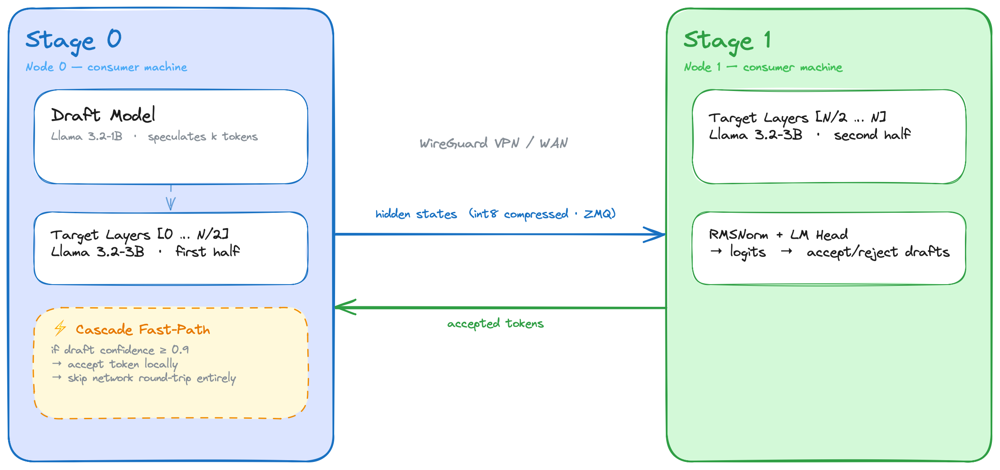

# Relay

> **A WAN-native runtime architecture for cooperative distributed LLM inference across trusted peers.**

Relay is a systems research project on distributed inference under non-datacenter conditions. It studies what changes when LLM execution is coordinated across authenticated, organization-controlled machines connected by realistic WAN links: tens to hundreds of milliseconds of RTT, asymmetric bandwidth, heterogeneous CPUs, and intermittent availability.

Relay does **not** attempt to replace inference kernels. It treats kernel execution as a solved substrate and focuses instead on orchestration: stage placement, scheduling, speculative execution, runtime control, and measurement under realistic network constraints.

<p align="center">
  
</p>

## Overview

Most distributed inference work assumes datacenter conditions: low-jitter fabrics, homogeneous accelerators, and tightly managed clusters. Relay explores a different regime:

- trusted peers rather than public admission
- WAN latency rather than rack-scale links
- heterogeneous hosts rather than uniform accelerators
- runtime coordination rather than kernel reinvention

The project is positioned as **distributed inference infrastructure research**: a runtime architecture and experimental harness for studying cooperative inference across trusted nodes.

## Thesis

**Most distributed inference systems assume datacenter conditions. Relay explores what changes when inference is coordinated across trusted peers over realistic WAN links.**

The central systems questions are:

1. How should a runtime place and coordinate inference stages when RTT is material relative to per-token compute?
2. When do speculative decoding and speculative pipelining become net-positive over WAN links?
3. How should scheduling adapt to heterogeneous peers with asymmetric compute, memory bandwidth, and uplink capacity?
4. What failure, queueing, and transport behaviors emerge once inference spans real private WAN paths rather than a single box or LAN?

Relay's claim is intentionally narrow: **once kernel efficiency improves enough, WAN coordination becomes the dominant open problem.**

## Research Position

Relay is:

- a distributed inference runtime
- a WAN-aware orchestration layer
- a systems research project
- a coordination architecture for trusted-node inference
- a benchmark harness for cooperative multi-node execution

Relay is not:

- a decentralized AI marketplace
- a permissionless peer swarm
- a crypto or token project
- a volunteer compute network
- a remote code execution framework
- a from-scratch inference kernel project

## What Relay Owns

Relay is explicit about the implementation boundary:

| Layer | Owner | Role |
|---|---|---|
| Quantized kernels, GGML execution, device-specific low-level optimization | `llama.cpp` | Fast token-generation substrate on CPU and Apple Silicon |
| KV cache implementation | `llama.cpp` | Stage-local cache management on the active path |
| RPC-based layer partitioning | `llama.cpp` | Existing mechanism for graph partition and remote stage execution |
| Trusted control plane | Relay | Membership, topology, orchestration policy, benchmark harness |
| WAN-aware scheduling | Relay | Stage placement, runtime coordination, speculative policy |
| Speculative pipelining experiments | Relay | Hiding draft compute inside verifier/network wait |
| WAN measurement and experimental methodology | Relay | Reproducible experiments across private multi-node deployments |

This layering is a strength. Relay does not claim novelty in kernels. Its research surface is **runtime behavior above the kernel layer**.

## Runtime Model

Relay models distributed inference as a **fixed-operation runtime** over authenticated peers. Nodes do not execute arbitrary code received from other peers. They exchange a constrained set of inference-specific operations:

- activation transport between stages
- stage-local forward execution
- KV-cache reset and trim
- speculative verification and token return
- telemetry and topology observations
- lifecycle and orchestration control

That fixed vocabulary is important to the security model and to the research framing: Relay studies cooperative inference, not general-purpose remote execution.

## Architecture

Relay separates **control-plane responsibilities** from **data-plane execution**.

### Control Plane

The control plane is responsible for:

- explicit stage membership
- authenticated peer admission
- topology description
- latency and bandwidth observations
- stage placement and routing policy
- experiment configuration and reproducibility

In the current repository, this logic appears as checked configuration, deployment scripts, authenticated envelopes, and benchmark harnesses. The long-term direction is a more explicit orchestration layer above `llama.cpp` RPC.

### Data Plane

The data plane is the per-token execution path:

1. Stage 0 performs local decode work and initiates a verifier round.
2. Intermediate or remote stages execute their assigned graph partition.
3. The final stage returns logits or sampled-token metadata.
4. Relay applies runtime logic such as speculative verification, acceptance, cache control, and next-step scheduling.

The data plane is deliberately narrow. Peers exchange activations, token metadata, telemetry, and cache-control signals; they do not receive scripts, plugins, or arbitrary compute tasks.

### Execution Semantics

At a high level, Relay assumes:

- **deterministic stage ownership**: each stage is assigned to a specific trusted node
- **authenticated membership**: nodes are admitted by configuration and shared trust material, not public discovery
- **stage-local state**: each node owns its local weights, KV state, and execution timing
- **orchestrated decode**: Stage 0 coordinates draft/verifier behavior and token advancement
- **WAN-visible cost model**: RTT, jitter, and asymmetric bandwidth are treated as first-class scheduling inputs

### Control Plane / Data Plane Sketch

```text
Trusted control plane
  - explicit membership
  - shared trust boundary
  - topology + telemetry
  - scheduling policy

Runtime data plane
  Stage 0 ── activations / control ──▶ Stage 1 ── ... ──▶ Stage N
     ▲                                                       │
     └──────── verifier result / sampled token / stats ──────┘
```

### Stage-0-Centric Decode Loop

```text
prompt/prefix
   │
   ▼
Stage 0
  - local forward / draft work
  - optional speculative prefetch
  - send verifier batch
   │
   ▼
Remote stage(s)
  - execute assigned partition
  - update local KV state
  - return logits / token metadata
   │
   ▼
Stage 0
  - verify / accept / reject
  - trim/reset as needed
  - schedule next round
```

## Current Implementation State

The repository is organized around a single active direction: a `llama.cpp`-backed runtime.

- `llama.cpp` owns kernels, quantization, KV behavior, and RPC stage execution
- Relay sits above that surface and owns orchestration, scheduling policy, and the experimental harness
- the research focus is "what runtime policies matter once kernels are already fast?" rather than "can we hand-build a fast inference path?"

An earlier Python/HuggingFace reference runtime (model slicing, ZMQ activation transport, hand-rolled int8 quant) produced the bf16 and dynamic-quant numbers in the comparison table below and was then removed once the kernel question closed. The pivot was evidence-driven; see [Current Findings](#current-findings).

## Current Findings

### Kernel-Layer Conclusion

The repository's most important result so far is that the low-level kernel question largely closed once `llama.cpp` was measured directly.

#### Path A diagnostic + Path B kernel validation

Llama-3.2-3B on an M4 MacBook Air:

| backend | precision | TPS | output | speedup vs HF CPU bf16 |
|---|---|---:|---|---:|
| HF / PyTorch CPU | bf16 | 3.37 | coherent | 1.0x |
| HF / PyTorch MPS | bf16 | 7.74 | coherent | 2.3x |
| HF / PyTorch CPU + `torch.ao` int8 | int8 dyn | 1.31 | gibberish | 0.4x |
| `llama.cpp` CPU (`-ngl 0`) | Q4_K_M | 38.31 | coherent | 11.4x |
| `llama.cpp` Metal | Q4_K_M | 43.45 | coherent | 12.9x |

Interpretation:

- hand-rolled dynamic int8 on the HF path was both slower and lower-quality
- `llama.cpp` Q4_K_M removed most of the per-token compute bottleneck on the same hardware
- once compute shrinks by roughly an order of magnitude, WAN coordination becomes the more interesting systems question

### Baseline WAN Result on the Reference Path

Two DigitalOcean droplets, HF bf16 reference runtime:

| variant | TPS |
|---|---:|
| no-spec | 3.15 |
| spec `k=2` | 2.77 |

At that operating point, speculative decoding did not beat the non-speculative baseline.

### What These Results Mean

The findings point to a cleaner research story:

1. Kernel optimization is not the right place for Relay to differentiate.
2. The relevant open problem is orchestration once efficient kernels exist.
3. Speculative pipelining is only interesting if WAN latency becomes a material share of the round budget.
4. The next empirical question is not "can we write faster kernels?" but "under what latency and heterogeneity regimes do runtime policies change throughput meaningfully?"

## Experimental Methodology

Relay is intended to be experimentally grounded. The repository already includes local and multi-node harnesses for controlled runs, plus an analytical gate for speculative pipelining.

### Measurement Principles

- compare runtime variants under fixed prompts and seeds
- separate kernel effects from orchestration effects
- record topology and latency conditions explicitly
- treat WAN RTT, jitter, and bandwidth as independent variables
- write kill/confirm criteria before running speculative experiments

### Current Speculative-Pipelining Gate

The current decision framework is documented in [docs/EXPERIMENT_SPECULATIVE_PIPELINING.md](/Users/blakefullerton/Desktop/Code/PipeLineParralel/docs/EXPERIMENT_SPECULATIVE_PIPELINING.md). The working question is:

> Does hiding draft computation inside the verifier round-trip ever beat no-spec over realistic WAN latency?

The analytical model is intentionally simple:

```text
T_round(no-spec)        ~= T_v + R
T_round(vanilla spec)   ~= T_d * k + T_v + R
T_round(pipelined spec) ~= max(T_d * k, T_v + R)
```

That model exists to prevent post hoc storytelling. If no plausible crossover appears with measured Q4 timings, the mechanism should be dropped rather than defended rhetorically.

## Why `llama.cpp`

Relay uses `llama.cpp` because it empirically outperformed the project's hand-built HF path on the target hardware class, and because its design lines up with Relay's current scope:

- strong CPU and Apple Silicon performance
- mature quantized inference path
- existing RPC support for layer partitioning
- no need to re-solve quantization or low-level kernel scheduling inside Relay

This is not a retreat from technical ambition. It is a narrowing of scope toward the part of the system that remains genuinely open: distributed runtime coordination over WAN links.

## Security Model

Relay assumes a **trusted cooperative cluster**, not public or permissionless participation.

### Trust Boundary

Nodes are expected to be:

- explicitly configured
- connected by a private overlay or equivalent trusted network path
- authenticated at the runtime layer
- operated by one person, one organization, or a trusted collaboration boundary

### Supported Runtime Surface

Relay is designed around inference-specific message types, not arbitrary execution. The intended operation set is limited to:

- activation forwarding
- cache control
- speculative verification
- telemetry
- lifecycle coordination

### Current Hardening Direction

The repository already reflects several security-oriented corrections:

- runtime traffic uses constrained message envelopes rather than raw Python object deserialization
- authenticated runtime messaging is supported through shared trust configuration
- peer discovery is no longer the default trusted deployment model

Open hardening work remains, including stronger node identity, tighter bind policy, replay protection, and stricter payload validation. Those are engineering requirements for a trusted inference runtime, not optional polish.

## Deployment and Reproducibility

Relay includes deployment utilities for local and cloud experiments. The current deployment story is oriented around reproducible WAN-style measurements, not production serving.

### `llama.cpp` Local Kernel Reference

```bash
llama-bench -hf unsloth/Llama-3.2-3B-Instruct-GGUF:Q4_K_M -ngl 0
llama-bench -hf unsloth/Llama-3.2-3B-Instruct-GGUF:Q4_K_M
```

### `llama.cpp` Runtime Bring-Up

Single-machine baseline:

```bash
.venv/bin/python deploy/llama_baseline.py \
  --config config.llama.local.yaml \
  --prompt "the future of distributed compute is"
```

Two-machine RPC planning:

```bash
.venv/bin/python deploy/llama_rpc_baseline.py plan
.venv/bin/python deploy/llama_rpc_baseline.py doctor
```

Those commands drive the active `llama.cpp`-backed runtime.

## Repository Layout

```text
relay/
├── src/
│   └── speculative_pipelining.py   # analytical model + decision gate
├── deploy/
│   ├── llama_baseline.py           # single-machine llama.cpp baseline
│   ├── llama_rpc_baseline.py       # two-machine RPC bring-up (plan/doctor/run)
│   ├── speculative_pipelining_model.py     # predict-vs-baseline grid
│   └── speculative_pipelining_analyze.py   # measured-vs-model comparison
├── docs/
│   └── EXPERIMENT_SPECULATIVE_PIPELINING.md
├── tests/
├── config.llama.local.yaml
└── config.llama.rpc.yaml
```

## Research Roadmap

### Active

1. Complete the `llama.cpp`-backed two-machine RPC baseline on a trusted private network.
2. Measure speculative pipelining under controlled injected RTT with pre-declared kill/confirm criteria.
3. Build topology-aware orchestration around heterogeneous peers once the basic RPC path is established.
4. Extend measurement from same-provider cloud baselines to multi-ISP WAN conditions.

### Deferred or Parked

- cascade and early-exit experiments, pending clarity on value under the `llama.cpp` execution model
- custom transport replacement, unless the stock RPC transport proves to be load-bearing
- deeper branching speculation variants before the single-chain speculative-pipelining question is resolved

## Non-Goals

Relay is not trying to be:

- a production serving framework
- a generic cluster scheduler
- a replacement for datacenter inference stacks
- a public peer-compute fabric
- a remote execution substrate
- a claim that commodity WAN inference is universally efficient

The narrower goal is more credible: understand the practical limits of cooperative inference across trusted peers once realistic WAN conditions are part of the runtime model.

## Long-Term Vision

The long-term ambition is technically broad but empirically grounded:

> investigate when cooperative inference across trusted WAN-connected machines is practical, when it is not, and which runtime policies determine that boundary.

That includes negative results. If a technique fails outside datacenter conditions, Relay should be able to show that clearly. If a policy becomes useful only after kernel costs fall below a certain threshold, Relay should make that threshold measurable.

In that sense, Relay is less a product thesis than a runtime-systems question:

**What are the actual operating limits of WAN-distributed cooperative LLM inference?**
